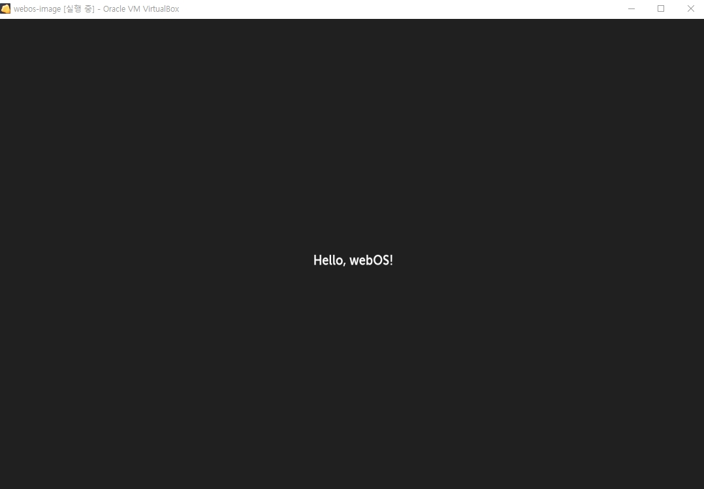

# 서비스만들기
{: .no_toc }

## Table of contents
{: .no_toc .text-delta }

1. TOC
{:toc}

---

## 서비스 만들기
webOS 서비스를 만들어보자.<br>
* 참고사이트 : [https://www.webosose.org/docs/tutorials/js-services/developing-external-js-services/](https://www.webosose.org/docs/tutorials/js-services/developing-external-js-services/)

아래와 같이 실행하면 샘플서비스에 대한 코드가 생성된다.<br>

```
> ares-generate -t js_service sampleService
? service id com.domain.app.service
Generating js_service in D:\sampleService
Success
```

세부코드분석은 나중에 하고 step4에 package 를 만들어보자.<br>
<small>(메뉴얼이 불친절하다. 아래의 cmd로 만들수 있다.) </small>

```
> ares-package sampleApp sampleService
Create com.domain.app_1.0.0_all.ipk to D:\
Success
```

step5와 같이 설치해보자.<br>

```
> ares-install --device emulator com.domain.app_1.0.0_all.ipk
Installing package com.domain.app_1.0.0_all.ipk
Success
```

음...설치해도 동일하게 Hello, Web Application!만 나온다.<br>
step6와 같이 cmd로 실행해야 js 서비스가 실행된다.<br>

```
> ares-shell -r "luna-send -n 1 -f luna://com.domain.app.service/hello '{\"name\":\"webOS\"}'" -d emulator
{
    "returnValue": true,
    "Response": "Hello, webOS!"
}
```

