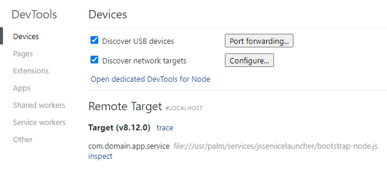
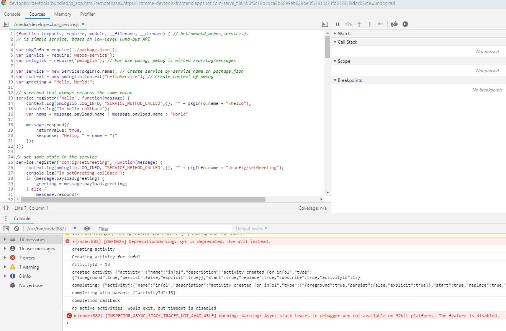

# 서비스만들기
{: .no_toc }

## Table of contents
{: .no_toc .text-delta }

1. TOC
{:toc}

---

## 서비스 만들기
webOS 서비스를 만들어보자.<br>
* 참고사이트 : [https://www.webosose.org/docs/tutorials/js-services/developing-external-js-services/](https://www.webosose.org/docs/tutorials/js-services/developing-external-js-services/)

아래와 같이 실행하면 샘플서비스에 대한 코드가 생성된다.<br>

```
> ares-generate -t js_service sampleService
? service id com.domain.app.service
Generating js_service in D:\sampleService
Success
```

세부코드분석은 나중에 하고 step4에 package 를 만들어보자.<br>
<small>(메뉴얼에는 그냥 링크만... 아래의 cmd로 만들수 있다.) </small>

```
> ares-package sampleApp sampleService
Create com.domain.app_1.0.0_all.ipk to D:\
Success
```

step5와 같이 설치해보자.<br>

```
> ares-install --device emulator com.domain.app_1.0.0_all.ipk
Installing package com.domain.app_1.0.0_all.ipk
Success
```

음...설치해도 동일하게 Hello, Web Application!만 나온다.<br>
step6와 같이 cmd로 실행해야 js 서비스가 실행된다.<br>

```
> ares-shell -r "luna-send -n 1 -f luna://com.domain.app.service/hello '{\"name\":\"webOS\"}'" -d emulator
{
    "returnValue": true,
    "Response": "Hello, webOS!"
}
```


web service도 CLI로 디버깅이 가능하다.<br>
web app에서는 바로 chrome browser로 열리는데, service는 그렇게 실행되지 않는다.<br>

```
>ares-inspect --device emulator --service com.domain.app.service
To debug your service, set "localhost:56783" on Node's Inspector Client(Chrome DevTools, Visual Studio Code, etc.).
```
메뉴얼 및 comment를 보면 node's inspector client에서 실행하라고 한다.<br>
inspector clients를 보면 여러가지 설명이 있는데(오픈소스라서 더 많은듯)<br>
그 중에서 chrome devtools로 실행하는 방법은 chrome browser에서 "chrome://inspect" 를 입력하고<br>
"configure" 에 위의 cmd 창에 나온 주소를 입력해주면 아래와 같이 remote target에서 tracing이 가능하다.<br>



그리고 trace를 누르고 inspect를 선택하면 화면이 나온다.<br>



처음이 실행하면 소스코드가 안보이는데, ctrl+p로 찾고 싶은 js를 선택하면 볼 수 있다.<br>
sampleService의 경우에는 helloworld_webos_service.js를 검색하면 볼 수 있다.<br>
