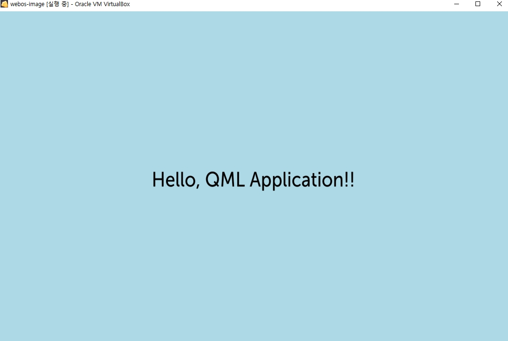

# QML 앱만들기
{: .no_toc }

## Table of contents
{: .no_toc .text-delta }

1. TOC
{:toc}

---

## QML 앱만들기
QML 앱만들기을 만들어보자.<br>
* 참고사이트 : [https://www.webosose.org/docs/tutorials/qml-apps/developing-external-qml-apps/](https://www.webosose.org/docs/tutorials/qml-apps/developing-external-qml-apps/)

sampleApp 이랑 폴더가 겹쳐서 폴더면 뒤에 qml만 붙여서 생성했다.

```
> ares-generate -t qmlapp sampleAppqml
? app id com.domain.app
? title new app
? version 1.0.0
Generating qmlapp in D:\sampleAppqml
Success
```
web Apps에는 index.html이 있지만, qml Apps에는 main.qml이 있다.<br>
step4로 가서 QML APP을 package 해보자.<br>

```
> ares-package sampleAppqml
Create com.domain.app_1.0.0_all.ipk to D:\
Success
```

app id를 web app과 동일하게 하다보니, 같은 파일이 생성되었다.<br>
그냥 설치해본다.<br>

```
> ares-install --device emulator com.domain.app_1.0.0_all.ipk
Installing package com.domain.app_1.0.0_all.ipk
Success
```

음...실행해보면...뭔가 화면이 안보인다...<br>
그래서 기존 package를 삭제하고 다시 설치해본다.<br>

```
> ares-install --device emulator --remove com.domain.app
Removed package com.domain.app

> ares-install --device emulator com.domain.app_1.0.0_all.ipk
Installing package com.domain.app_1.0.0_all.ipk
Success
```

다시 실행해보면 아래와 같이 화면이 보인다.<br>


