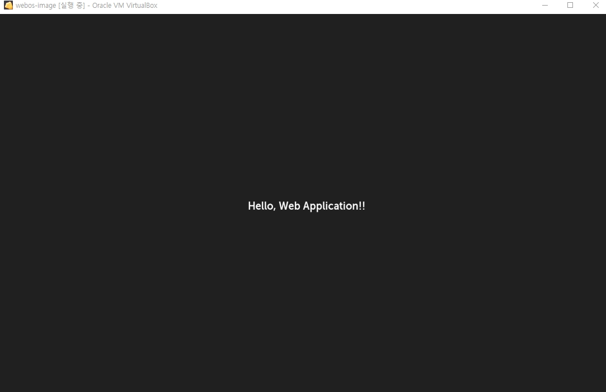

# 앱만들기
{: .no_toc }

## Table of contents
{: .no_toc .text-delta }

1. TOC
{:toc}

---

## 앱 만들기
webOS 앱을 만들어보자.<br>
자세한 내용은 나중에 보고, 우선 에뮬레이터에 간단하게 앱부터 실행해보자.<br>
개발환경은 window10에서 실행했고, virtual box에 에뮬레이터 설치해서 시작해보자.<br>
우선 아래의 가이드에 따라서 CLI 설치 및 환경설정 추가.<br>
* 환경설정 : [https://www.webosose.org/docs/tutorials/web-apps/developing-external-web-apps/](https://www.webosose.org/docs/tutorials/web-apps/developing-external-web-apps/)
<br>
step1을 실행하자마자 error가 발생한다.<br>

```
> ares-generate -t webapp sampleApp
? app id com.domain.app
? title new app
? version 1.0.0
ares-generate ERR! ares-generate: Error: 'git' command is not available on this machine.
```

ares-generate 를 실행하면 git에서 sample source를 가져오는 것 같다.<br>
그래서 윈도우용 git을 설치하고 다시 시도한다. <br>
* git download : [https://git-scm.com/downloads](https://git-scm.com/downloads)

```
>ares-generate -t webapp sampleApp
? app id com.domain.app
? title new app
? version 1.0.0
Generating webapp in D:\sampleApp
Success
```

여기까지 실행하면 sampleApp 폴더에 생성된다.<br>
이제 step2,3은 건너뛰고, step4의 package 를 해보자.<br>

```
>ares-package sampleApp
Create com.domain.app_1.0.0_all.ipk to D:\
Success
```

폴더에 com.domain.app_1.0.0_all.ipk 파일이 생성되었다.<br>
step5의 package install 을 해야 하는데, 하기 전에 device 설정이 필요하다.<br>
* device-setup : [https://www.webosose.org/docs/tools/sdk/cli/cli-user-guide/#ares-setup-device](https://www.webosose.org/docs/tools/sdk/cli/cli-user-guide/#ares-setup-device)
하지만 emulator에 실행하므로 특별하게 설정하지 않았고, device 이름은 아래와 같이 확인할 수 있다.<br>

```
>ares-setup-device --list
name      deviceinfo                connection  profile
--------  ------------------------  ----------  -------
emulator  developer@127.0.0.1:6622  ssh         ose
```

그리고 install 하면 설치가 완료된다.<br>

```
>ares-install --device emulator ./com.domain.app_1.0.0_all.ipk
Installing package ./com.domain.app_1.0.0_all.ipk
Success
```

이제 실행해보자.<br>

```
>ares-launch --device emulator com.domain.app
Launched application com.domain.app on display 0
```


마지막으로 종료해보자.<br>

```
>ares-launch --device emulator --close com.domain.app
Closed application com.domain.app on display 0
```

