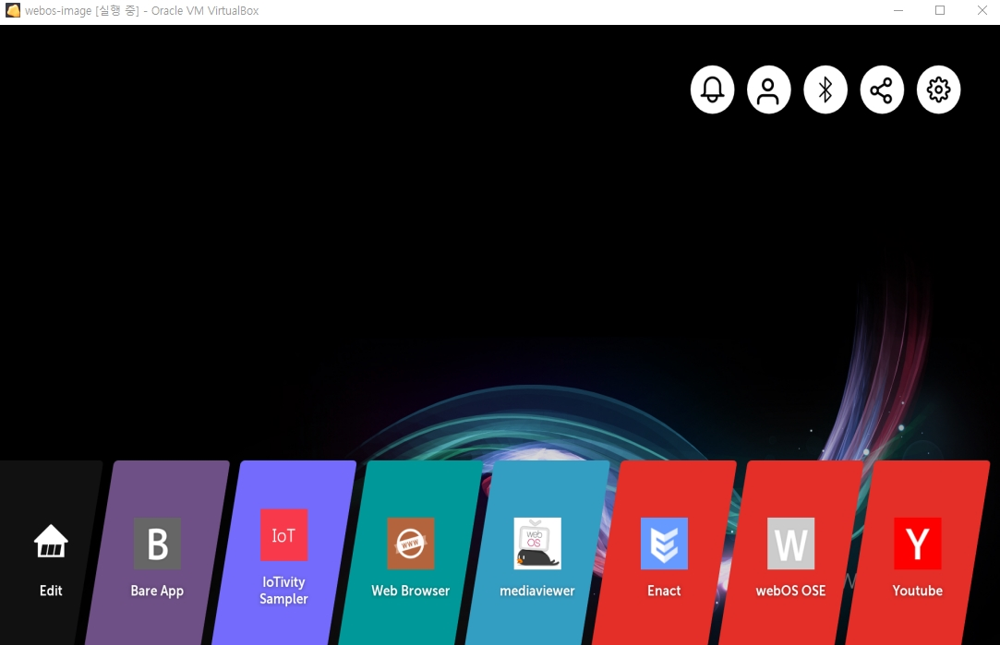

# 시작하기
{: .no_toc }

## Table of contents
{: .no_toc .text-delta }

1. TOC
{:toc}

---

## 우선 해보자
webOS에 대해 잘 몰라도 우선 시작해볼 수 있다. 
build 환경이 없어도 release 되는 이미지를 다운로드 받아서 해볼 수 있으며, 
Raspberry Pi 4 와 같은 device가 없어도 emulator로 실행해 볼 수 있다. 
* 이미지 다운로드 : [http://build.webos-ports.org/webosose/](http://build.webos-ports.org/webosose/)
* 에뮬레이터 설정 : [https://www.webosose.org/docs/tools/sdk/emulator/virtualbox-emulator/emulator-user-guide/](https://www.webosose.org/docs/tools/sdk/emulator/virtualbox-emulator/emulator-user-guide/)

에뮬레이터로 실행하면 아래와 같이 실행되는 것을 확인할 수 있고, 
Web Browser와 Youtube 를 실행해 볼 수 있다. 
 
<small>* 아래의 이미지는 webos-image-qemux86-master-20200528044350.wic 버전으로 실행한 결과</small>

